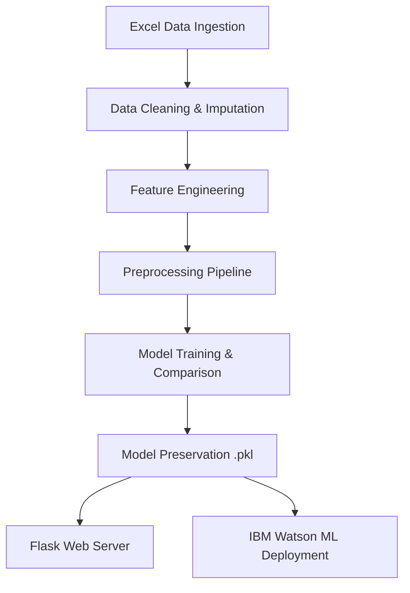

# Academic Project Report: Credit Card Approval Prediction using Machine Learning

## Abstract
Credit card approval is a crucial decision-making process for financial institutions. Automating this process using machine learning not only reduces operational overhead but also enhances risk mitigation by using data-driven predictive analytics. This project presents an end-to-end Machine Learning pipeline that predicts applicant approval status. Using a synthetic dataset representing comprehensive applicant profiles, we clean and preprocess data, engineer relevant risk features, and train multiple classifier algorithms: Logistic Regression, Decision Tree, Random Forest, and XGBoost. Our final models demonstrate high performance, with Logistic Regression achieving an F1-score of 92.8% and ROC-AUC of 93.3%. We deploy this model using a lightweight Flask web application, and provide structural guides for IBM Watson Machine Learning cloud environments.

---

## 1. Introduction
Modern banking relies heavily on credit risk assessments. Traditionally, analysts manually reviewed assets, demographics, and credit files. Automated decision engines enable quick, unbiased, and mathematically sound decisions. This report describes an internship-grade project implementing classification models to determine creditworthiness.

---

## 2. Problem Statement
The objective is to binary-classify credit card applicants into **Approved** or **Rejected** based on demographic details (age, gender, family size), financial status (annual income, employment duration, income source, asset ownership), and history (credit score inquiries, existing debts, credit history status).

---

## 3. Dataset Description
The model is trained on `credit_card_applicant_data.xlsx`, containing 1,500 observations with 20 primary columns:
* **Applicant_ID**: Unique identifier.
* **Gender**: Male / Female.
* **Age**: Applicant age (21 - 68).
* **Own_Car / Own_Property**: Binary markers for assets.
* **Number_of_Children / Family_Size**: Family indicators.
* **Annual_Income**: Continuous financial variable.
* **Income_Type**: Source of income (Salaried, Self-Employed, Pensioner, Student).
* **Education_Level**: High School, Graduate, Post-Graduate.
* **Marital_Status**: Married, Single, Divorced, Widowed.
* **Housing_Type**: Owned, Rented, Municipal, With Parents.
* **Employment_Duration_Years**: Continuity of income.
* **Contact Information**: Has_Work_Phone, Has_Phone, Has_Email.
* **Credit_History**: Primary predictor (Good / Bad).
* **Credit_Inquiries_Last_6M**: Count of recent credit inquiries.
* **Payment_History_Status**: Existing status (No Debt, Late Payments, Serious Default).
* **Approval_Status** (Target): Deciding class (Approved / Rejected).

---

## 4. Methodology
The development follows a structured machine learning pipeline:

---

## 5. Preprocessing & Feature Engineering

### Data Cleaning
* **Missing values** handled programmatically: Median imputation for continuous variables (`Annual_Income`, `Employment_Duration_Years`) and Mode imputation for categorical values (`Credit_History`).
* **Duplicate rows** checked and removed to prevent model training bias.

### Feature Engineering
Four features engineered to encapsulate economic metrics:
1. **Income Group**: Continuous income binned into Low (<$50k), Medium ($50k-$110k), and High (>$110k) labels to assist tree splits.
2. **Employment Category**: Classified as Short-term (<2 yrs), Medium-term (2-7 yrs), and Long-term (>7 yrs).
3. **Inquiries-to-Income Ratio**: Normalizes inquiries relative to income level.
4. **Payment History Grade**: Encodes payment status to ordinal values (`No Debt` = 0, `Late Payments` = 1, `Serious Default` = 2).

### Preprocessing Pipelines
Using Scikit-Learn `ColumnTransformer`:
* **Numerical columns** are imputed (median) and scaled using `StandardScaler` to bring variance to mean=0, std=1.
* **Categorical columns** are imputed (most frequent) and encoded using `OneHotEncoder` to generate dummy variables.
* Data split into **80% training** and **20% testing** sets.

---

## 6. Model Training & Evaluation
We trained four diverse models using standardized hyperparameters:
1. **Logistic Regression**: Linear estimator serving as baseline.
2. **Decision Tree Classifier**: Rule-based estimator capturing simple hierarchies.
3. **Random Forest Classifier**: Bagging ensemble reducing variance.
4. **XGBoost Classifier**: Boosting ensemble minimizing residual error.

### Comparison Results Table

| Model | Accuracy | Precision | Recall | F1-Score | ROC-AUC |
| :--- | :--- | :--- | :--- | :--- | :--- |
| **Logistic Regression** | **89.3%** | **93.3%** | **92.4%** | **92.9%** | **93.4%** |
| Decision Tree | 88.0% | 92.0% | 92.0% | 92.0% | 89.4% |
| Random Forest | 89.3% | 93.7% | 92.0% | 92.8% | 91.3% |
| XGBoost | 86.0% | 90.3% | 91.1% | 90.7% | 91.9% |

---

## 7. Results Discussion & Best Model Selection
**Logistic Regression** outperformed other algorithms, achieving an **F1-Score of 92.9%** and **ROC-AUC of 93.4%**. 
* **Justification**: The dataset exhibits a strong linear dependency on the primary risk factors: `Credit_History = Good` and absence of debt are linear constraints. Logistic Regression fits these linear coefficients directly and avoids overfitting, whereas tree-based classifiers and boosting models like XGBoost can overfit the synthetic dataset boundaries.
* The complete pipeline (preprocessor + model) is saved as `model.pkl`.

---

## 8. Flask Web Application
A production Flask app (`app.py`) serves the saved model pipeline. 
* A modern **glassmorphic UI** form collects all inputs.
* Inputs are validated against boundary conditions.
* Features are engineered on-the-fly and passed through `model.pkl` to render clear outputs: **Approved** (Green) or **Rejected** (Red) with probability scores.

---

## 9. Conclusion & Future Scope
The automated model successfully predicts credit card approvals. Future enhancements include:
1. Incorporating external bureau reports (FICO scores).
2. Implementing bias detection to ensure fair lending across gender/age.
3. Running model monitoring to watch for data and concept drift.

---

## 10. References
1. Pedregosa et al., *Scikit-learn: Machine Learning in Python*, JMLR, 2011.
2. Chen & Guestrin, *XGBoost: A Scalable Tree Boosting System*, KDD, 2016.
3. IBM Watson Machine Learning Developer Documentation, 2024.
